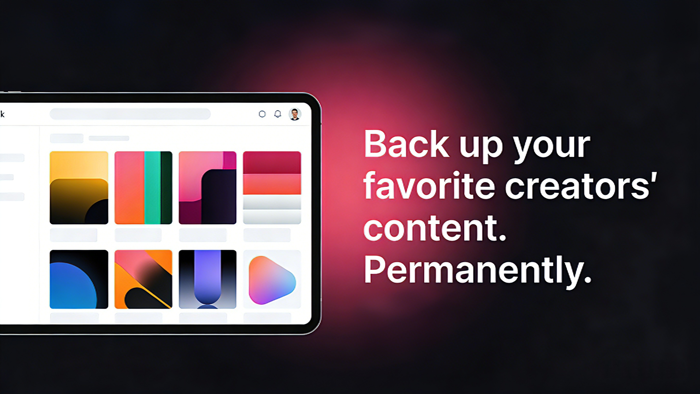

# Creatordown — OnlyFans Downloader for Mac & Windows

**Save photos, DRM-protected videos, and purchased PPV from the OnlyFans creators you subscribe to — as normal files, in one click.**

[**Download**](https://creatordown.com/#download) · [Website](https://creatordown.com) · [Help Center](https://creatordown.com/help/) · [Blog](https://creatordown.com/blog/)

---

## What is Creatordown?

Creatordown is a native desktop app for **macOS** and **Windows** that backs up content from creators you subscribe to on OnlyFans. Sign in with your own account, pick a creator, and Creatordown downloads their photos and videos to your computer so you can keep and watch them offline — even after a subscription ends or a creator deletes their posts.

It is **not** a browser extension and **not** a command-line script. There's nothing to configure: no Python, no cookies to copy, no CDM files.

## Features

- **DRM video support** — OnlyFans videos are protected with Widevine DRM. Creatordown saves them as regular, playable `.mp4` files. No black-screen recordings.
- **Download an entire creator** — select a creator and download their whole catalog automatically, hundreds of posts in one click.
- **Posts, messages, and PPV** — photos and videos from subscription posts and direct messages, including PPV posts and messages you've purchased.
- **Metadata preserved** — creator name, post date, and caption saved alongside every file, organized by creator.
- **Parallel downloads** — segmented downloading built for large libraries and slow connections.
- **100% local and private** — nothing is uploaded anywhere. You log in through OnlyFans' own page in the app's built-in browser; your session stays on your computer.

## Download

| Platform | Installer |
|----------|-----------|
| macOS (Apple Silicon — M1/M2/M3/M4) | [CreatorDown-arm64.dmg](https://app.creatordown.com/releases/latest/CreatorDown-arm64.dmg) |
| macOS (Intel) | [CreatorDown-x64.dmg](https://app.creatordown.com/releases/latest/CreatorDown-x64.dmg) |
| Windows 10 / 11 | [CreatorDown.exe](https://app.creatordown.com/releases/latest/CreatorDown.exe) |

Every version is also attached to [GitHub Releases](../../releases). All downloads include a **free 3-day trial** with full access — no credit card required. See [pricing](https://creatordown.com/#pricing).

## How it works

1. **Install** Creatordown on your Mac or Windows PC.
2. **Sign in** to your OnlyFans account in the app's built-in browser.
3. **Choose** a creator, or pick individual posts and messages.
4. **Download** — files are saved to a folder you choose, organized by creator.
5. **Watch offline** anytime, on your computer or copied to your phone.

## Why not a browser extension, screen recorder, or script?

| Method | Photos | DRM-protected video | Whole creator at once | Setup |
|--------|:------:|:-------------------:|:---------------------:|-------|
| Browser extensions (Chrome, Edge, Firefox) | ✅ | ❌ | Partial | Easy |
| Screen recording (OBS, Game Bar, iPhone) | ✅ | Often black screen | ❌ | Easy |
| yt-dlp | ✅ | ❌ | ✅ (non-DRM) | Technical |
| Command-line scrapers | ✅ | Only with your own CDM files | ✅ | Technical |
| **Creatordown** | ✅ | ✅ | ✅ | **Easy** |

More detail: [Best OnlyFans Downloader in 2026](https://creatordown.com/blog/best-onlyfans-downloader-2026/) · [Why OnlyFans extensions stop working](https://creatordown.com/blog/onlyfans-chrome-extension-not-working/) · [How to record OnlyFans screen](https://creatordown.com/blog/record-onlyfans-screen/)

## FAQ

**Does it download DRM-protected OnlyFans videos?**
Yes. Videos are saved as normal `.mp4` files in original quality.

**Can I download all posts from a creator at once?**
Yes. Select a creator and Creatordown downloads their entire catalog in the background. → [Guide](https://creatordown.com/blog/download-all-posts-from-onlyfans-creator/)

**Does it support PPV and messages?**
Yes — PPV posts and PPV messages you've purchased, plus photos and videos from direct messages.

**Will the creator know I downloaded their content?**
No. Creators aren't notified, and OnlyFans can't see what software runs on your computer. → [Details](https://creatordown.com/blog/is-it-safe-to-download-onlyfans/)

**Do I have to give Creatordown my OnlyFans password?**
No. You sign in on OnlyFans' own login page inside the app. Your login never reaches Creatordown's servers.

**Does it work on iPhone or Android?**
Creatordown runs on Mac and Windows. You can copy downloaded files to your phone afterward. → [iPhone guide](https://creatordown.com/blog/screen-record-onlyfans-iphone/)

**Can I download content I haven't paid for?**
No. Creatordown only downloads content your own account already has access to.

More answers in the [Help Center](https://creatordown.com/help/).

## Guides

- [How to Save OnlyFans Videos in 2026: Every Method Tested](https://creatordown.com/blog/how-to-save-onlyfans-videos/)
- [How to Download OnlyFans Videos to Your PC or Laptop](https://creatordown.com/blog/download-onlyfans-videos-to-pc/)
- [OnlyFans Downloader for PC and Mac](https://creatordown.com/blog/onlyfans-downloader-for-pc-mac/)
- [How to Backup Your OnlyFans Subscriptions](https://creatordown.com/blog/how-to-backup-onlyfans-subscriptions/)
- [How to Download OnlyFans Content Before Your Subscription Expires](https://creatordown.com/blog/download-onlyfans-before-unsubscribe/)

## Support

- Help Center: https://creatordown.com/help/
- Email: [hello@creatordown.com](mailto:hello@creatordown.com)
- Bug reports and feature requests: [open an issue](../../issues)

## Responsible use

Creatordown is for personal backup of content your account is authorized to access. Don't redistribute creators' content. See the [Terms of Service](https://creatordown.com/terms/) and [Privacy Policy](https://creatordown.com/privacy/).

---

This repository hosts Creatordown's release downloads and documentation. Creatordown is independent software and is not affiliated with or endorsed by OnlyFans.
